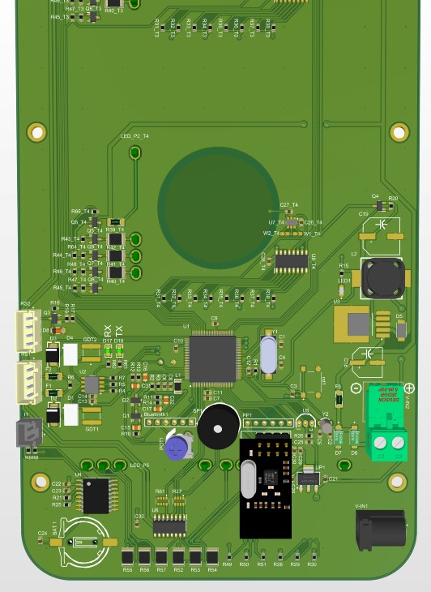
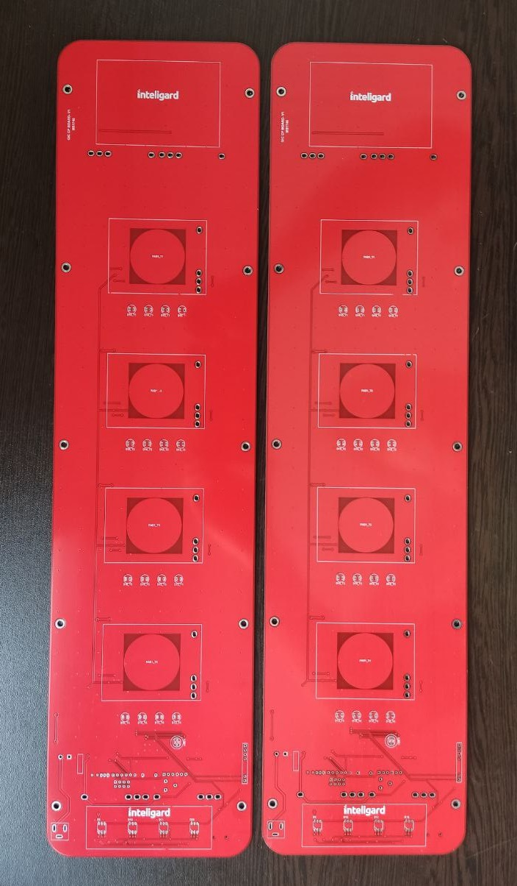
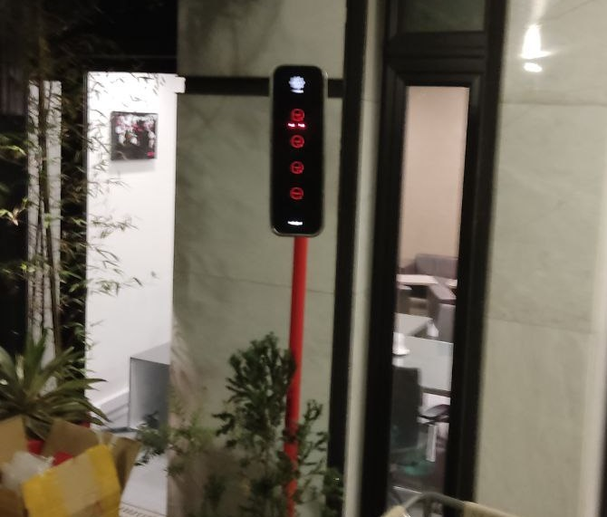

# Control Panel PCB
This PCB is designed for a client that wanted a panel with 4 touch sensors to control 4 relays over a local wired network. The touch sensors on the board have back-light LEDs which show the state of the sensor. All the boards are connected together with the RS485 network and this panel sends commands to a relay board. The shape of the PCB was pre-defined by the client.

